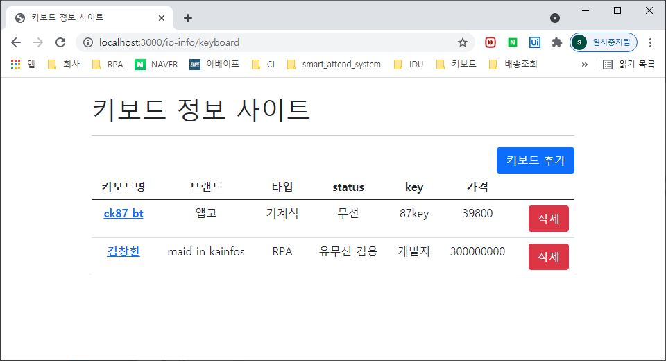

# 202112713_KCH
## ⌨ 키보드 정보 페이지

<br>
</img>
</img>
<br>
<br>


### 🔗 AWS
---
<http://3.37.144.15:3000/io-info>

<br>

---
####  ⚡통신규약[GEt]
---
#### ⌨ 키보드 정보 입력

| URL | 메소드 | 
|:---:|:---:|
|/io-info/keyboard/create|GET|


#### ⌨ 키보드 정보 수정

| URL | 메소드 | 
|:---:|:---:|
|/io-info/keyboard/create|GET|

#### ⌨ 키보드 정보 삭제

| URL | 메소드 | 
|:---:|:---:|
|/io-info/keyboard/create|GET|

#### ⌨ 키보드 전체 조회

| URL | 메소드 | 
|:---:|:---:|
|/io-info/keyboard|GET|

| 메세지 구조 |  | | 
|:---|:---|:---| 
|msg| | 성공/실패 메세지| 
|data| | 책 입력 정보|
| | no | 제품 번호 |
| | name | 키보드 명 |
| | brand | 키보드 브랜드 |
| | keytype | 키보드 타입 |
| | status | 키보드 유형 |
| | code | 키보드 layout |
| | price | 키보드 가격 |
<br>

> <b>메세지 예</b>
```json
{
    "msg": "select list success",
    "data": [
        {
            "no": 1,
            "name": "ck87",
            "brand": "앱코",
            "keytype": "기계식",
            "status": "유선",
            "code": "87kwy",
            "price": 39800
        },
        {
            "no": 1,
            "name": "ck108 BT",
            "brand": "앱코",
            "keytype": "기계식",
            "status": "무선",
            "code": "108kwy",
            "price": 59800
        }
    ]
}
```

<BR>
---
####  ⚡통신규약[GEt]
---

#### ⌨ 키보드 정보 입력(DB 입력)
<br>

| URL | 메소드 | 
|:---:|:---:|
|/io-info/keyboard/create|POST|
<br>

| 메세지 구조 |  | | 
|:---|:---|:---| 
|data| | 책 입력 정보|
| | no | 제품 번호 |
<br>

> <b>메세지 예</b>
```json
{
    "msg": "select list success",
    "data": [
        {
            "no": 1
        }
    ]
}
```


####  ⚡ 데이터베이스 설계
---
<br>

|데이터 베이스| 
|:---:| 
|idu_node_final_db|
<br>

|테이블명| 
|:---:| 
|keyboard|
<br>

|칼럼명|칼럼ID|타입(길이)| PK | NN |AI|비고| 
|:---|:---:|:---|:---:|:---|:---:|:---:| 
|키보드 번호|no|int(11)|O|O|O| | 
|키보드 명|name|varchar(255)|||| | 
|키보드 브랜드|brand|varchar(255)|||| | 
|키보드 타입|keytype|varchar(255)|||| | 
|키보드 유형|status|varchar(255)||||유선/무선 | 
|키보드 layout|code|varchar(255)|||| key code| 
|키보드 가격|price|int(11)|||| | 
<br>

